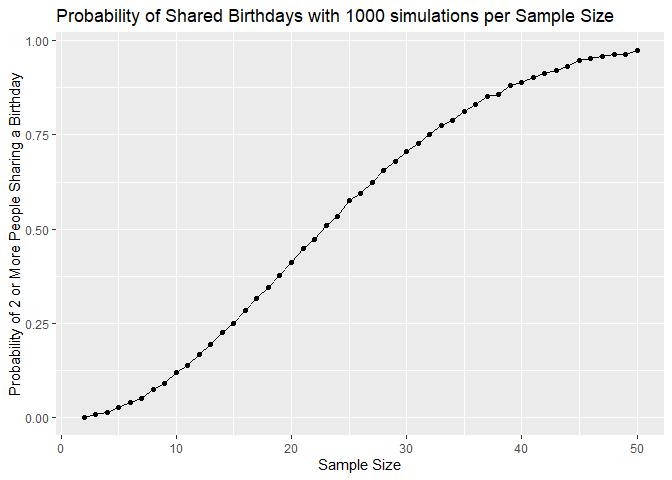
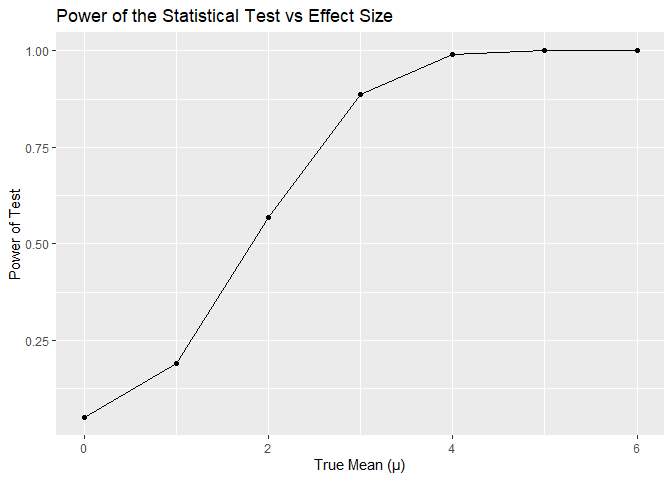
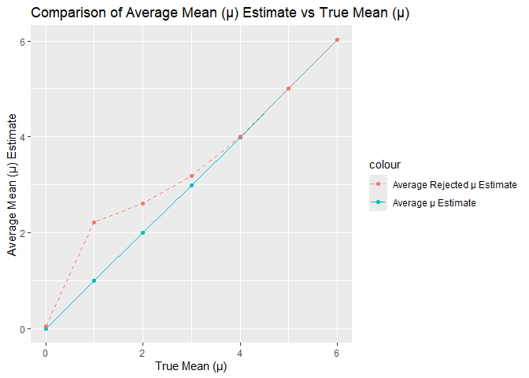
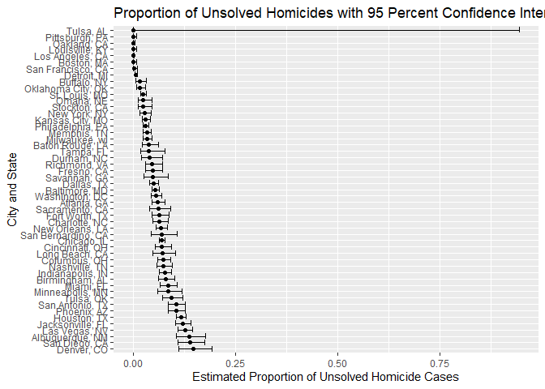

Homework 5
================

# Problem 1

``` r
set.seed(1)

#shared birthday function#

birthdays_shared <- function(n) {
  birthdays <- sample(1:365, n, replace = TRUE)
  return(length(unique(birthdays)) < n)
}

#creation of group sizes and probabilities)

group_sizes <- 2:50
probabilities <- numeric(length(group_sizes))

#simulations based on how many experiments#

another_experiment <- function(n, number, birthdays_shared) {
  x = 0
  for(i in 1:number){
    birthdays_shared(n)
    
    if(birthdays_shared(n) == TRUE){
      x = x + 1
    }
    else{
      x = x
    }
  }
  x
}

#10,000 simulations for all sample sizes#

for (i in 2:50) {
  number_of_successes <- another_experiment(i, 10000, birthdays_shared(i))
  probabilities[i-1] <- number_of_successes/10000
}

#birthday data frame created#

birthday_df <- data.frame(
  group_size = group_sizes,
  probability = probabilities
)

#plot created#

birthday_df |> ggplot(aes(x = group_size, y = probability)) +
  geom_point() + geom_line() +
  labs(x = "Sample Size",
       y = "Probability of 2 or More People Sharing a Birthday",
       title = "Probability of Shared Birthdays with 1000 simulations per Sample Size")
```

<!-- -->

As the group size increases, the probability that at least two people
share the same birthday also increases. Notably, at around a group size
of 23 people, such probability crosses the 0.5 threshold. Finally, even
at around a group size of 45 to 50, the probability is already
approaching a value of 1.0.

# Problem 2

``` r
set.seed(1)

#creation of variables#

alpha <- 0.05
sample_size <- 30
sigma <- 5
mu_values <- 0:6

#function for a sample of sample size n#

sim_mean_sd <- function(n, mu, sigma) {

  x = rnorm(n, mean = mu, sd = sigma)
  test <- t.test(x, mu = 0)
  
  tibble(
      mu_true = mu,
      mu_hat = mean(x),
      p_value = test$p.value
    )
}

#5,000 simulations for each true mean#

sim_results_df = 
  expand_grid(
    true_mean = c(0, 1, 2, 3, 4, 5, 6),
    true_sd = sigma,
    iter = 1:5000
  ) |> mutate(
    estimate_df = 
      map(true_mean, \(mean) sim_mean_sd(sample_size, mu = mean, sigma))
  ) |> unnest(estimate_df)

#summary of test values#

summary_df <- sim_results_df |>
  group_by(mu_true) |>
  summarise(
    power = sum(p_value < alpha)/5000,
    average_mu_hat = mean(mu_hat),
    average_mu_hat_rejected = mean(mu_hat[p_value < alpha]))

#plot created for two plots of power and avergae mean estimate#

ggplot(summary_df, aes(x = mu_true, y = power)) +
  geom_line() + geom_point() +
  labs(
    x = "True Mean (μ)",
    y = "Power of Test",
    title = "Power of the Statistical Test vs Effect Size"
  )
```

<!-- -->

``` r
ggplot(summary_df, aes(x = mu_true)) +
  geom_point(aes(y = average_mu_hat, color = "Average μ Estimate")) +
  geom_line(aes(y = average_mu_hat, color = "Average μ Estimate")) +
  geom_point(aes(y = average_mu_hat_rejected, color = "Average Rejected μ Estimate")) +
  geom_line(aes(y = average_mu_hat_rejected, color = "Average Rejected μ Estimate"), linetype = "dashed") +
  labs(x = "True Mean (μ)",
       y = "Average Mean (μ) Estimate",
       title = "Comparison of Average Mean (μ) Estimate vs True Mean (μ)")
```

<!-- -->

As the effect size increases with our true mean, there is a positive
correlation between the effect size and the power of the statistical
test from our plot.

Meanwhile, when the true mean is 0, 3, 4, 5, and 6, the average mean
estimate for rejected samples is approximately equal to the
corresponding true mean value. However, when the true mean is 1 or 2,
our average mean estimate across rejected samples is above the true mean
by a significant degree. This may be because the power of the test for
lower effect size is also lower and would introduce larger
discrepancies.

# Problem 3

``` r
#read the homicide data#

homicide_stats <- read_csv("https://raw.githubusercontent.com/washingtonpost/data-homicides/refs/heads/master/homicide-data.csv")
```

    ## Rows: 52179 Columns: 12
    ## ── Column specification ────────────────────────────────────────────────────────
    ## Delimiter: ","
    ## chr (9): uid, victim_last, victim_first, victim_race, victim_age, victim_sex...
    ## dbl (3): reported_date, lat, lon
    ## 
    ## ℹ Use `spec()` to retrieve the full column specification for this data.
    ## ℹ Specify the column types or set `show_col_types = FALSE` to quiet this message.

``` r
#creation of city stats#

city_stats <- homicide_stats |>
  mutate(city_state = paste(city, state, sep = ", ")) |> mutate(status = case_when(
  disposition == "Closed without arrest" | disposition == "Open/No Arrest" ~ "Unsolved",
  disposition != "Closed without arrest" & disposition != "Open/No Arrest" ~ "Solved"
)) |> group_by(city_state) |>
  summarise(
    total_amount = n(),
    unsolved_count = sum(status == "Unsolved"))

#create and filter for Baltimore homicide rates#

baltimore_stats <- city_stats |>
  filter(city_state == "Baltimore, MD")

baltimore_test <- prop.test(
  baltimore_stats$unsolved_count,
  baltimore_stats$total_amount
)

baltimore_results <- broom::tidy(baltimore_test) |> select(estimate, conf.low, conf.high)

baltimore_results
```

    ## # A tibble: 1 × 3
    ##   estimate conf.low conf.high
    ##      <dbl>    <dbl>     <dbl>
    ## 1   0.0538   0.0459    0.0629

``` r
#confidence intervals for cities and states#

city_intervals <- city_stats |>
  mutate(
    prop_test = map2(unsolved_count, total_amount, ~ prop.test(.x, .y) |> tidy())
  ) |> unnest(prop_test) |>
  select(city_state, estimate, conf.low, conf.high)
```

    ## Warning: There was 1 warning in `mutate()`.
    ## ℹ In argument: `prop_test = map2(unsolved_count, total_amount,
    ##   ~tidy(prop.test(.x, .y)))`.
    ## Caused by warning in `prop.test()`:
    ## ! Chi-squared approximation may be incorrect

``` r
#plot for confidence intervals#

city_intervals |>
  arrange(desc(estimate)) |> mutate(city_state = factor(city_state, levels = city_state)) |>
  ggplot(aes(x = estimate, y = city_state)) + geom_point() +
  geom_errorbar(aes(xmin = conf.low, xmax = conf.high))+
  labs(
    x = "Estimated Proportion of Unsolved Homicide Cases",
    y = "City and State",
    title = "Proportion of Unsolved Homicides with 95 Percent Confidence Interval")
```

<!-- -->
